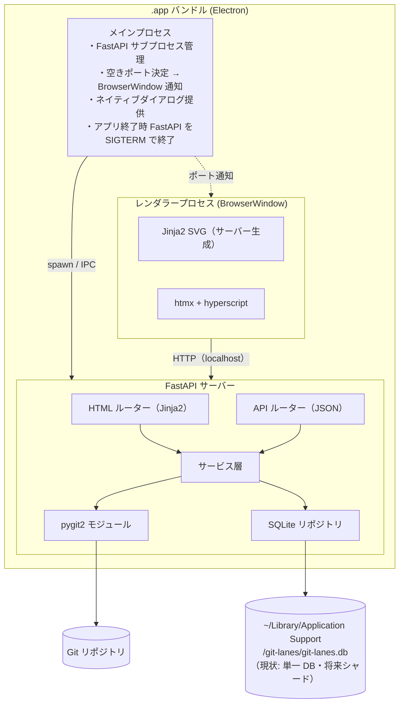
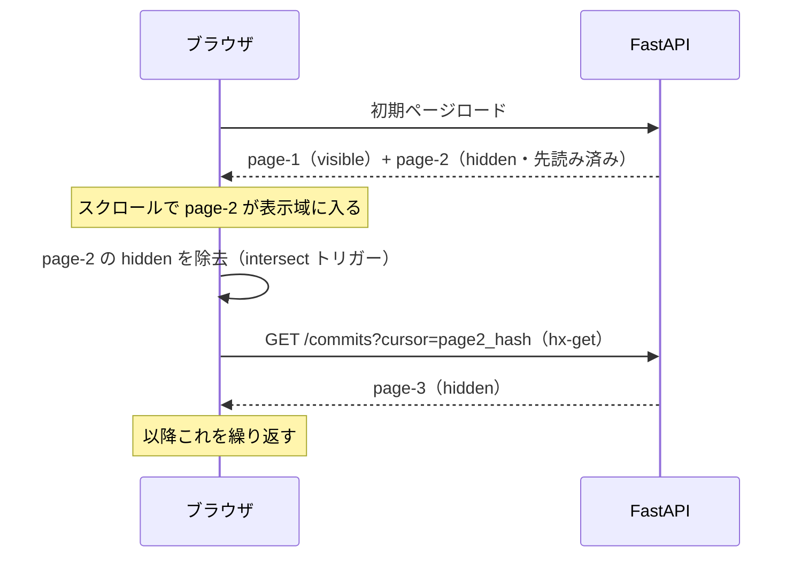

# Git Lanes - アーキテクチャ設計書

## システム全体像



---

## ディレクトリ構成

```
git-lanes/
├── docs/                        # 設計・仕様ドキュメント
│   ├── specification.md
│   ├── technology.md
│   └── architecture.md
├── electron/                    # Electron メインプロセス
│   ├── main.js                  # アプリエントリ・FastAPI 起動管理
│   ├── preload.js               # レンダラーに公開する IPC ブリッジ
│   └── server.js                # FastAPI サブプロセス管理（起動・終了・ポート決定）
├── backend/                     # FastAPI アプリ（現行のコード配置）
│   ├── main.py                  # アプリケーションエントリポイント
│   ├── paths.py                 # DB ディレクトリ解決（テスト用環境変数対応）
│   ├── routers/
│   │   ├── html.py              # HTML レスポンスルーター（htmx 向け）
│   │   └── api.py               # 登録などの API
│   ├── services/
│   │   ├── sync_service.py      # Git → SQLite 同期ロジック
│   │   └── graph_layout.py      # ブランチレーン座標計算（段階的に拡張）
│   ├── repositories/
│   │   ├── ddl.py               # SQLite DDL（起動時に IF NOT EXISTS で適用）
│   │   ├── git_repo.py          # pygit2 経由の Git リポジトリ操作
│   │   └── cache_repo.py        # SQLite CRUD
│   └── templates/
│       ├── base.html            # ベーステンプレート
│       ├── welcome.html         # ウェルカム画面（初回起動時）
│       ├── graph.html           # グラフ画面（左右分割レイアウト）
│       └── partials/
│           └── detail.html      # コミット詳細パネル（右ペイン・htmx 断片）
├── static/
│   └── css/
│       └── style.css            # JS ファイルは原則不要（htmx + hyperscript で完結）
├── tests/
│   ├── unit/                    # 単体テスト（pytest）
│   ├── integration/             # 統合テスト（pytest）
│   ├── e2e/                     # E2E テスト（pytest-playwright・Python）
│   │   └── test_*.py            # ページ操作・画面遷移のテスト
│   └── support/                 # テスト共通 fixture
├── dist/                        # electron-builder 出力先（git 管理外）
├── package.json                 # Electron・npm 依存定義
├── pyproject.toml               # Python 依存定義
└── README.md
```

---

## データフロー

### アプリ起動フロー（Electron）

```
1. ユーザーが Git Lanes.app をダブルクリック
2. Electron メインプロセス起動
3. server.js: 空きポートを探して FastAPI サーバーを subprocess として起動
4. server.js: FastAPI の /health エンドポイントをポーリングして起動完了を確認
5. main.js: BrowserWindow を生成し http://localhost:{port}/ をロード
6. 画面にグラフが表示される
7. アプリ終了時: BrowserWindow クローズ → FastAPI サブプロセスを SIGTERM で終了
```

### 初回アクセス時（キャッシュなし）

```
1. ブラウザ → FastAPI: GET /repos/{repo_id}/graph
2. FastAPI → SyncService: キャッシュ確認
3. SyncService → GitRepo: pygit2 でコミットをトポロジカル順に走査する（`git log --all --topo-order` 相当。実装段階では HEAD 起点に限定してよい）
4. SyncService → CacheRepo: INSERT commits / branches
5. FastAPI → CacheRepo: SELECT 直近 50 コミット
6. FastAPI → ブラウザ: HTML（SVG グラフ + htmx トリガー）
```

### 2 回目以降（キャッシュあり・差分なし）

```
1. ブラウザ → FastAPI: GET /repos/{repo_id}/graph
2. FastAPI → SyncService: HEAD ハッシュ比較 → 差分なし
3. FastAPI → CacheRepo: SELECT 直近 50 コミット
4. FastAPI → ブラウザ: HTML（キャッシュから即時返却）
```

### 過去コミットの追加読み込み（htmx）

```
1. ブラウザ → FastAPI: GET /repos/{repo_id}/commits?cursor=<hash>&limit=50
   （htmx: hx-get、hx-swap="beforeend"）
2. FastAPI → CacheRepo: SELECT cursor 以前の 50 コミット
3. FastAPI → ブラウザ: HTML 断片（追加コミットの SVG）
4. ブラウザ: htmx が受け取った断片を DOM に挿入する（クライアント側で D3.js 等による結合描画は行わない）
```

### 差分更新フロー（watchdog トリガー）

```
1. watchdog が .git/refs/ または .git/HEAD の変更を検知
2. SyncService → pygit2: 現在の HEAD ハッシュ取得
3. SyncService → CacheRepo: 保存済みの cached_head を取得
4. pygit2: cached_head が現在 HEAD の祖先かどうかを確認
   （merge-base --is-ancestor 相当）

   [祖先である → 通常の差分更新]
   5a. pygit2: cached_head..HEAD の差分コミットを取得
   6a. CacheRepo: INSERT OR IGNORE 差分コミット・ブランチ更新

   [祖先でない → rebase / force push による履歴書き換えを検出]
   5b. CacheRepo: 該当ブランチに紐づくコミットを DELETE
   6b. pygit2: ブランチ全件を再取得
   7b. CacheRepo: 全件 INSERT

8. FastAPI → ブラウザ: SSE または htmx ポーリングで再描画をトリガー
```

---

## データベース設計

### 永続ファイルの配置（現状）

最小縦スライスでは、**`GIT_LANES_DATA_DIR`** 環境変数があればそのディレクトリに、なければ `~/Library/Application Support/git-lanes/` に **`git-lanes.db`** を1つ作成し、全リポジトリの行を単一 SQLite に格納する（`repositories.path` の一意制約を効かせるため）。将来、設計書どおり **リポジトリ ID ごとの `.db` ファイル**へシャード化する場合は `backend/paths.py` を拡張する。

### `commits` テーブル

```sql
CREATE TABLE commits (
    hash        TEXT PRIMARY KEY,   -- フルコミットハッシュ
    short_hash  TEXT NOT NULL,      -- 短縮ハッシュ（7文字）
    message     TEXT NOT NULL,      -- コミットメッセージ（1行目）
    author_name TEXT NOT NULL,      -- 作者名
    author_email TEXT NOT NULL,     -- 作者メールアドレス
    committed_at INTEGER NOT NULL,  -- UNIX タイムスタンプ
    repo_id     TEXT NOT NULL,      -- リポジトリ識別子
    FOREIGN KEY (repo_id) REFERENCES repositories(id)
);
CREATE INDEX idx_commits_repo_committed_at ON commits(repo_id, committed_at DESC);
```

### `commit_parents` テーブル

```sql
CREATE TABLE commit_parents (
    commit_hash TEXT NOT NULL,
    parent_hash TEXT NOT NULL,
    position    INTEGER NOT NULL DEFAULT 0,  -- 0: 第1親、1: マージ元
    PRIMARY KEY (commit_hash, parent_hash),
    FOREIGN KEY (commit_hash) REFERENCES commits(hash),
    FOREIGN KEY (parent_hash) REFERENCES commits(hash)
);
```

### `branches` テーブル

```sql
CREATE TABLE branches (
    name        TEXT NOT NULL,
    tip_hash    TEXT NOT NULL,      -- ブランチ先端のコミットハッシュ
    is_remote   INTEGER NOT NULL DEFAULT 0,
    repo_id     TEXT NOT NULL,
    PRIMARY KEY (name, repo_id),
    FOREIGN KEY (tip_hash) REFERENCES commits(hash),
    FOREIGN KEY (repo_id) REFERENCES repositories(id)
);
```

### `repositories` テーブル

```sql
CREATE TABLE repositories (
    id          TEXT PRIMARY KEY,   -- UUID
    path        TEXT NOT NULL UNIQUE,
    name        TEXT NOT NULL,
    cached_head TEXT,               -- 最後に同期した HEAD ハッシュ
    synced_at   INTEGER             -- 最終同期 UNIX タイムスタンプ
);
```

---

## フロントエンド設計

### 画面レイアウト

画面を左右に二分割する。

| ペイン | 内容 |
| --- | --- |
| 左（メイン） | ブランチグラフ（SVG）＋スクロールによる増分ロード |
| 右（詳細） | クリックしたコミットの詳細（ハッシュ・メッセージ・作者・日時） |

初回起動時（リポジトリ未登録）はウェルカム画面を表示し、「フォルダを開く」ボタンで Mac ネイティブダイアログを呼び出す。

### SVG グラフの描画方針

- サーバーサイド（Python）でブランチレーンの座標を計算し、Jinja2 テンプレートで SVG を生成する
- 各ブランチに固定の X 座標（レーン）を割り当て、コミットを Y 軸方向に配置する
- エッジ（親子関係）は SVG の `<path>` 要素（二次ベジェ曲線）で描画する
- D3.js は使用しない

### ブランチ名・タグの表示仕様

**ブランチラベル（ローカル）**: コミットノードの右にブランチ名をテキストで表示する。

**リモートブランチの同期状態:**

| 状態 | 表示 |
| --- | --- |
| ローカルと同じコミットを指している | ブランチ名の前に **塗り潰し円** を表示 |
| ローカルと異なるコミットを指している | ブランチ名の前に **波線円** を表示 |

リモートブランチの表示はツールバーのトグルでオン/オフを切り替えられる。

**タグ**: コミットノードにタグ名をバッジとして表示する。ツールバーのトグルでオン/オフを切り替えられる。

### htmx による増分ロード（先読みスクロール）

ボタン操作は行わない。次のページを hidden 状態で先読みしておき、スクロールで表示域に入った時点で visible に切り替え、同時に更に次のページを先読みする仕掛けにする。

#### 先読みの流れ



#### HTML 構造

```html
<!-- 現在表示中のページ -->
<div id="page-1" class="commit-page">
  <!-- コミットの SVG ノード群 -->
</div>

<!-- 先読み済みの次ページ（hidden で待機） -->
<div
  id="page-2"
  class="commit-page"
  hidden
  hx-get="/repos/{repo_id}/commits?cursor={page2_first_hash}&limit=50"
  hx-trigger="intersect threshold:0.1"
  hx-swap="afterend"
  _="on htmx:afterSwap remove @hidden from me"
>
  <!-- サーバーから先読み済みのコミット SVG -->
</div>
```

- `hidden` 属性でレンダリングを抑制しつつ、コンテンツは DOM に存在する
- `hx-trigger="intersect threshold:0.1"` により、要素が表示域に 10% 入った時点で htmx がトリガーされる
- `hx-swap="afterend"` で更に次のページを hidden 状態で後続に挿入する
- `_="on htmx:afterSwap remove @hidden from me"` — hyperscript で自身の `hidden` 属性を除去する（`hx-on` 属性よりも読みやすい構文）
- ボタン操作なしで、スクロールだけでシームレスに過去コミットが現れる

#### データフローとの対応

```
過去コミットの増分ロード（先読みスクロール）:
1. FastAPI: 初期ページと同時に次ページ分も hidden HTML 断片を返す
2. ユーザーがスクロール → intersect トリガー発火
3. htmx → FastAPI: GET /repos/{repo_id}/commits?cursor=<hash>&limit=50
4. FastAPI → htmx: さらに次ページの hidden HTML 断片を返す
5. htmx: afterend に挿入し、現在ページの hidden を除去
6. サーバーが返した SVG/HTML 断片がそのまま表示される（レイアウト結合はサーバー側のテンプレート責務）
```

---

## 非機能設計

### キャッシュ戦略

| シナリオ | 戦略 |
| --- | --- |
| 初回ロード | Git から全履歴を取得し SQLite に格納 |
| 差分更新 | `cached_head..HEAD` の差分のみ取得 |
| ページング | SQLite の `OFFSET` / カーソルページングで取得 |

### エラーハンドリング

- Git リポジトリが見つからない場合: 404 を返し、ユーザーにパス確認を促す
- SQLite ロック競合: リトライ（最大 3 回）後に 503 を返す
- pygit2 による Git 操作が失敗: ログに記録し、最後に同期済みのキャッシュで表示を継続する

### セキュリティ

- リポジトリパスはサーバー側で許可リスト（`repositories` テーブル）と照合する
- ユーザー入力（カーソルハッシュなど）は正規表現でバリデーションする（`[0-9a-f]{7,40}`）
- Git 操作に `git` CLI（`subprocess`）は使わない（pygit2 のみ）。Electron が FastAPI を子プロセス起動するなど **必要な subprocess は引数リスト形式**とし、シェルインジェクションを防ぐ
